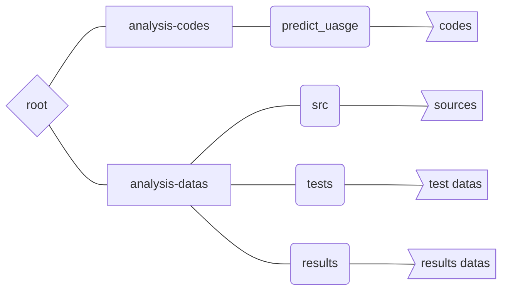

# analysis-codes
## fileMaps

```mermaid
  graph LR;
      id1{root} --- id2[analysis-codes]
        id2 --- id4(predict_uasge)
            id4 --- id5>codes]

      id1 --- id3[analysis-datas]
        id3 --- id6(src)
            id6 --- id7>sources]
        id3 --- id8(tests)
            id8 --- id9>test datas]
        id3 --- id10(results)
            id10 --- id11>results datas]
```